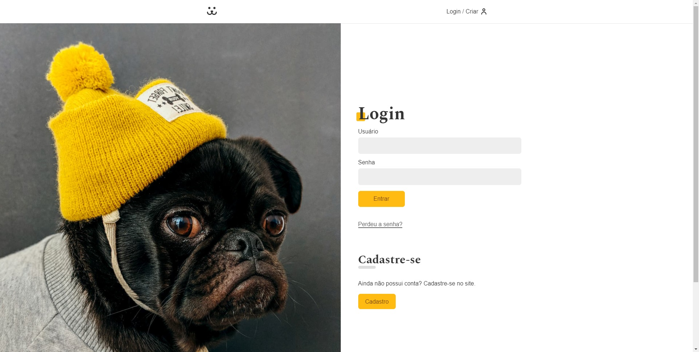
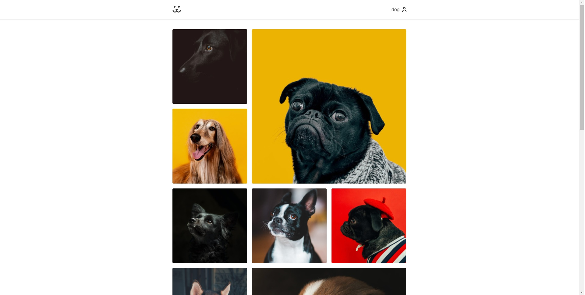
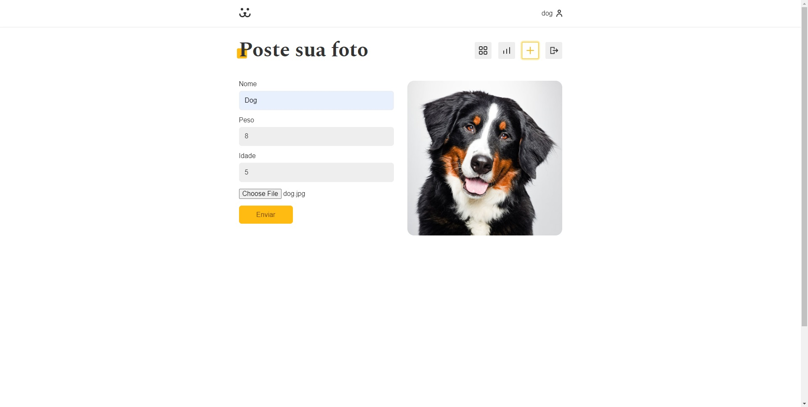
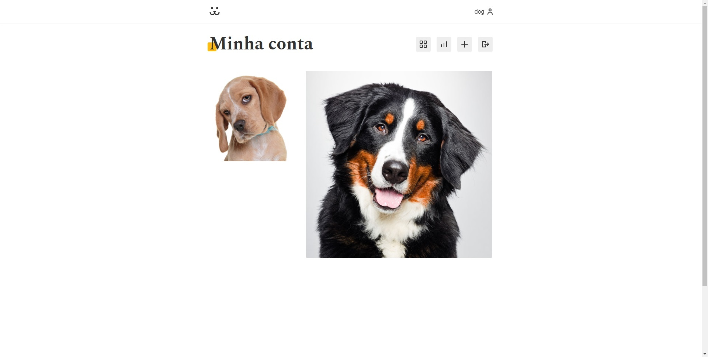
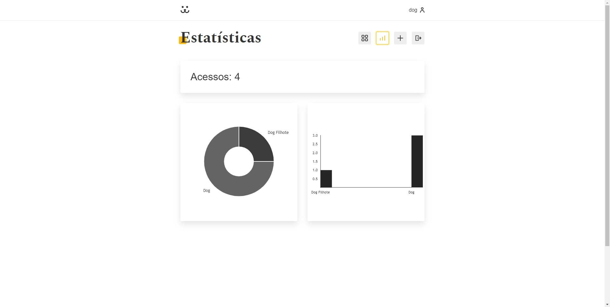

# 💻 DOGS - REDE SOCIAL DE CACHORROS

---

## 🗒️ Sobre o projeto

Dogs é uma rede social de cachorros, nela você pode postar fotos com o nome, peso e idade do cachorro, além de comentar também. 
Existe um feed com as fotos de todos os usuários e um feed particular com suas fotos. Em dogs também existe uma página de estatísticas
com a contagem de acessos das fotos do usuário.  
Esta aplicação foi feito com ReactJS e foi utilizado seus hooks, custom hooks, rotas com react-router-dom, context-api e uma biblioteca 
chamada Victory para os gráficos das estatísticas. 
O banco de dados e a api de onde foram feitas as requisições de login, fotos e outras são da origamid.

---

## 🛠 Tecnologias

### Frontend:

-   HTML
-   CSS
-   JavaScript
-   ReactJS

---

## 🎨 Screens

  LOGIN 
  

  FEED 
  

    POSTAGEM DE FOTO 
  

  CONTA DO USUÁRIO 
  

  ESTATÍSTICAS DO USUÁRIO 
  

